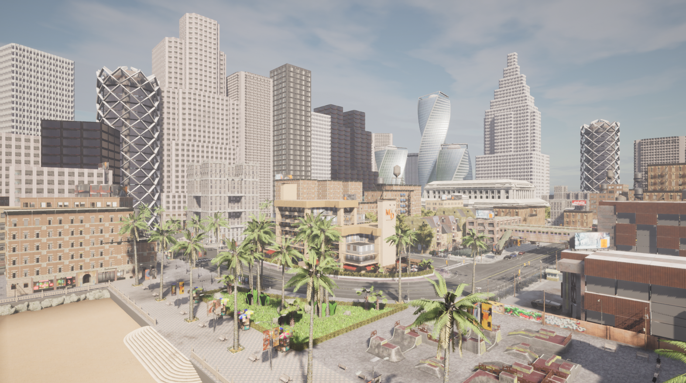

# Introduction
this is a simulation setup to use Carla simulator with ROS2.

# Installation
download Carla:
```bash
wget -v https://carla-releases.s3.us-east-005.backblazeb2.com/Linux/CARLA_0.9.13.tar.gz
```
```bash
tar xvzf CARLA_0.9.13.tar.gz -C /opt/carla/
```
install:
```bash
docker-compose up -d --build
```
# Run Carla Server
in the host machine:
```
cd /opt/carla/v0.9.13 && ./CarlaUE4.sh -prefernvidia
```
 

# Run Carla Client
in the docker container:

## NEW NOP function scenario
```
ros2 launch carla_l5player_bridge_ego_vis carla_bridge_ego_vehilce.launch.py
python3 src/l5player_functions/carla_l5player_nop/carla_scripts/vehicle_gallery_aeb.py
ros2 run carla_l5player_nop carla_l5player_nop_node                                              
ros2 launch carla_l5player_nop nop_launch.py 
```

## NOP function scenario 
```
ros2 launch carla_l5player_bridge_ego_vis carla_bridge_ego_vehilce.launch.py
python3 src/l5player_functions/carla_l5player_nop/carla_scripts/vehicle_gallery_aeb.py
ros2 run carla_l5player_nop_with_python_script carla_l5player_nop_with_python_script_node        
ros2 launch carla_l5player_nop_with_python_script nop_launch.py 
```
## AEB function scenario
``` 
ros2 launch carla_l5player_bridge_ego_vis carla_bridge_ego_vehilce.launch.py
python3 src/l5player_functions/carla_l5player_nop/carla_scripts/vehicle_gallery_aeb.py
ros2 run carla_l5player_aeb_with_python_script carla_l5player_aeb_with_python_script_node
```
## LQR PID Controller with Waypoint
```
ros2 launch carla_ros_bridge carla_ros_bridge_with_example_ego_vehicle.launch.py
ros2 launch carla_l5player_lqr_pid_controller_waypoint lqr_launch.py
ros2 launch carla_waypoint_publisher carla_waypoint_publisher.launch.py
```
## NEW PID 
```
ros2 launch carla_l5player_bridge_ego_vis carla_bridge_ego_vehilce.launch.py
ros2 run carla_l5player_pid_new_controller carla_l5player_pid_new_controller_node
ros2 launch carla_l5player_pid_new_controller new_pid_launch.py
```
## PID 
```
ros2 launch carla_l5player_bridge_ego_vis carla_bridge_ego_vehilce.launch.py
ros2 run carla_l5player_pid_controller carla_l5player_pid_controller_node
```
## Stanley 
```
ros2 launch carla_l5player_bridge_ego_vis carla_bridge_ego_vehilce.launch.py
ros2 run carla_l5player_stanley_pid_controller carla_l5player_stanley_pid_controller_node
```
## LQR 
```
ros2 launch carla_l5player_bridge_ego_vis carla_bridge_ego_vehilce.launch.py
ros2 launch carla_l5player_lqr_pid_controller lqr_launch.py
```
## MPC 
```
ros2 launch carla_l5player_bridge_ego_vis carla_bridge_ego_vehilce.launch.py
ros2 launch carla_l5player_mpc_controller mpc_launch.py
```
## Scene Simulator
First, add the carla simulator to the same directory as this project through a soft link, and then enter the project directory
```
ros2 launch carla_ad_demo carla_ad_demo_with_scenario.launch.py scenario_runner_path:=/app/scenario_runner-0.9.13
```